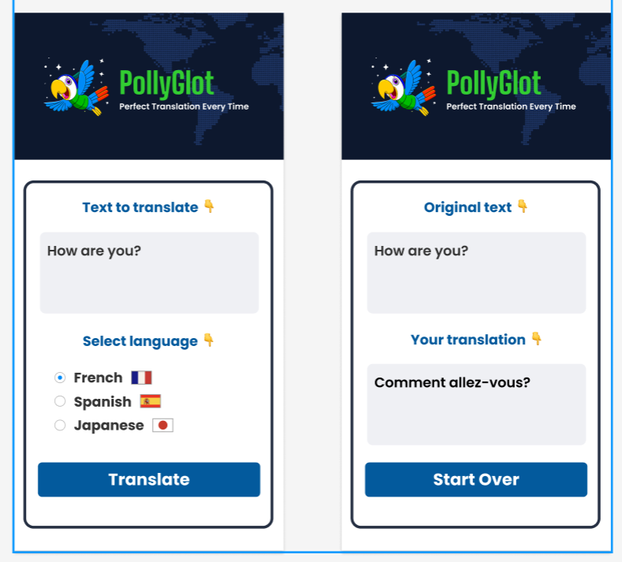

# PollyGlot — Translation App 🦜

Веб-приложение для перевода текста с использованием **OpenRouter API** (модель `openai/gpt-oss-20b:free`).

## Скриншот



## Возможности

- 🌐 Перевод на несколько языков (French, Spanish, Japanese)
- 🦜 Красивый дизайн с логотипом-попугаем
- ⚡ Быстрый перевод через OpenRouter API
-  Адаптивный дизайн

## Установка и запуск

### 1. Клонируйте репозиторий

```bash
git clone https://github.com/ВАШ_ЮЗЕРНЕЙМ/pollyglot.git
cd pollyglot
```

### 2. Установите зависимости

```bash
npm install
```

### 3. Настройте API ключ

Скопируйте шаблон и добавьте свой ключ:

```bash
copy .env.example .env
```

Откройте `.env` и замените `YOUR_API_KEY_HERE` на ваш реальный ключ:

```env
OPENROUTER_API_KEY=sk-or-v1-xxxxxxxxxxxxxxxxxxxx
```

> 🔑 Получить ключ можно бесплатно на [openrouter.ai/keys](https://openrouter.ai/keys)

### 4. Запустите приложение

```bash
npm run dev
```

Откройте в браузере: **http://localhost:5173**

## Структура проекта

```
pollyglot/
├── index.html          # HTML-разметка
├── index.css           # Стили
├── index.js            # Клиентская логика
├── server.js           # Express-сервер + API к OpenRouter
├── vite.config.js      # Конфигурация Vite (прокси + CSP)
├── package.json        # Зависимости
├── .env                # Переменные окружения (НЕ коммитить!)
├── .env.example        # Шаблон .env (коммитить)
├── .gitignore          # Исключения для Git
└── assets/             # Изображения (флаги, логотип, карта)
```

## Технологии

- **Frontend**: Vanilla JS, Vite
- **Backend**: Express.js, node-fetch
- **API**: OpenRouter (openai/gpt-oss-20b:free)
- **Конфигурация**: dotenv

## Переменные окружения

| Переменная | Описание | По умолчанию |
|---|---|---|
| `OPENROUTER_API_KEY` | Ключ OpenRouter API | *(обязательно)* |
| `MODEL` | Модель для перевода | `openai/gpt-oss-20b:free` |
| `PORT` | Порт Express-сервера | `3001` |

## Лицензия

MIT
